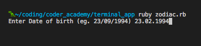
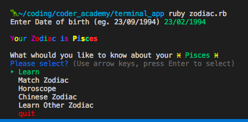
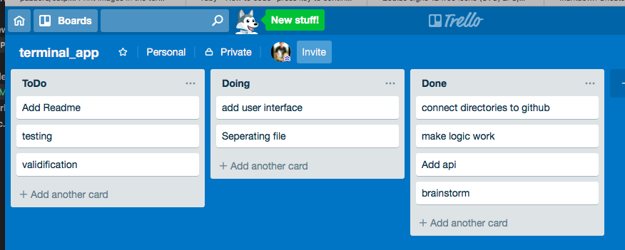

# Purpose

Based on user date of birth inputs (DD/MM/YYYY), ZodiacMe will return user personality traits based on your Zodiac (Western Zodiac) and Chinese Horoscope. It will also suggest matching level pairing with your partner Zodiac.

## Functionality

Based on user selection, ZodiacMe will display selection button to enable each features of the personality traits to be displayed separately, then back to main selection to take further selection.

## Dependencies

The Ruby gems 'httparty' 'zodiac' 'tty-prompt' 'colorize' 'ruby_emoji' needs to be installed to run ZodiacMe.
ZodiacMe returns zodiac data from https://zodiacal.herokuapp.com/api

## Instructions for use

This will install the following Ruby gems specified in the Gemfile:
%w{colorize zodiac httparty tty-prompt ruby_emoji}.each { |x| require x }

```ruby
%w{colorize zodiac httparty tty-prompt ruby_emoji}.each { |x| require x }
```

To initialise program, enter:

```terminal
~ Ruby zodiac.rb
```

### Ready to go!

From the main menu, run Ruby zodiac.rb

Enter the date of birth
format accept are [dd/mm/yyyy , dd.mm.yyyy , yyyy-mm-dd]



if valid date is enter the terminal will ask user to select what they want to do



### Time management

we use trello to hep us define the features flow and logic to boost the performance in an organised way and systematic manner



## Project Plan & TimeLine

the scope for ZodiacMe was built within two working days.

- Day1 BrainStorm to get the data or to hard coded them. We found Zodiac api that already containing information in it. Our codes are to enable user to put their dob and return output resulted from Zodiac and from Chinese Horoscope
- Day 2 Finalising the app and moving the codes to separate files so the application can be extended upon needs. The applicaton tested against abnormalities. The comments added for each unclear part of the codes.

### Coding Process

- After decide the data structure our first task is to get the api data from https://zodiacal.herokuapp.com and to use it in ruby enviroment and being ableto display it on terminal
- we implement code to take user input using prompt and use that data to retrive associate data from zodiacal api
- we modifly the app to be user freindly interface
- we add some extra fucntion that provide any other data that is not provide by zodiacal api
- we test the application with varios of input and also make sure all function are working properly

### Challenges

- adding emoji to visualize the zodiax
- to retrive the data from real world api instead of creating our own data
- to test the validation of the Date input

### Future Enchancements

- add horoscope option
- to display image
- to make the emoji biggr

### Contributer

---

<a href = https://github.com/mos311063 > </a>
<span> Moss </span>

<a href = https://github.com/sellys></a>
<span> Sellys </span>
